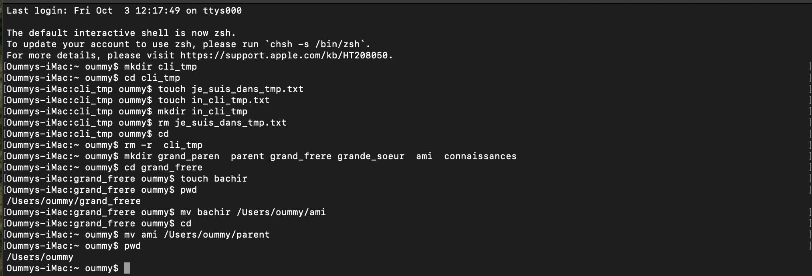

# Correction de l'exercice N°1

## les Commandes Utilisées

``` mkdir ``` : Pour créer un ou plusieurs nouveau(s) dossier(s), je l'ai utilisé pour créer le dossier **cli_tmp**
Syntaxe: ```mkdir nom_du_dossier```

``` cd ``` : Pour Aller d'un repertoire à un autre, je l'ai utilisé pour aller de mon repertoir personnel au dossier **cli_tmp**.
Syntaxe: ```cd nom_du_repertoir```

NB: pour retourner dans son repertoir personnel il suffit de taper la commande ```cd```sans ajouter quelque chose.

```touch``` : Pour créer un ficher, je l'ai utilisé pour créer le fichier texte **in_cli_tmp**.
Syntaxe: ```touch nom_du_fichier```

```rm``` : Pour supprimer un fichier/dossier,je l'ai utilisé dans l'xercice pour supprimer le fichier **je_suis_dans_tmp.txt**

Pour supprimer un dossier il faut ajouter l'option ```-r```(récursif) afin d'indiquer à la commande rm de supprimer le dossier ainsi que tout son contenu.

syntaxe:

Supprimer un simple fichier: ```rm nom_du_fichier```

Supprimer un dossier: ```rm -r nom_du_dossier```

```pwd``` : Pour afficher le chemin vers l'emplacement courant de l'utilisateur (ex: **/Users/oummy/grand_frere**)

```mv``` : Pour deplacer/renommer un fichier/dossier, je l'ai utilisé pour deplacer le dossier **ami** vers le dossier **parent**

Syntaxe: 

|  | Fichier          | Dossier |
| :--------------- |:---------------:| -----:|
| Déplacer  |   ```mv nom_du_fichier  chemin/vers/l'/emplacement```      |  ```mv nom_du_dossier chemin/vers/l'/emplacement```
| Renommer  | ```mv nom_actuel_du_fichier nouveau_nom_du_fichier```             |  ```mv nom_actuel_du_dossier nouveau_nom_du_dossier```  |


## Capture d'écran de l'exercice

