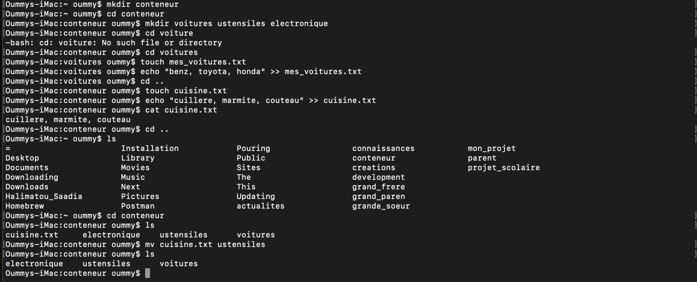

# Correction de l'exercice N°2

## les Commandes Utilisées

``` mkdir ``` : Pour créer un ou plusieurs nouveau(s) dossier(s), je l'ai utilisé pour créer le dossier **conteneur voitures ustensiles electronique** 
Syntaxe: ```mkdir nom_du_dossier```

``` cd ``` : Pour Aller d'un repertoire à un autre, je l'ai utilisé pour aller de mon repertoir personnel au dossier **conteneur**.
Syntaxe: ```cd nom_du_repertoir```

NB: pour retourner dans son repertoir personnel il suffit de taper la commande ```cd```sans ajouter quelque chose.

```touch``` : Pour créer un ficher, je l'ai utilisé pour créer le fichier texte **mes_voitures.txt cuisine.txt**.
Syntaxe: ```touch nom_du_fichier```

```echo``` : Pour ajouter du texte dans un fichier

syntaxe:

```echo "texte_à_ajouter" >> nom_du_fihier_destinataire```

```ls``` : Pour lister le contenu  d'un dossier 

Syntaxe: ```ls nom_du_dossier```

```cat``` : Pour afficher le contenu d'un fichier texte

Syntaxe: 
```cat nom_du_fichier.txt```


## Capture d'écran de l'exercice

