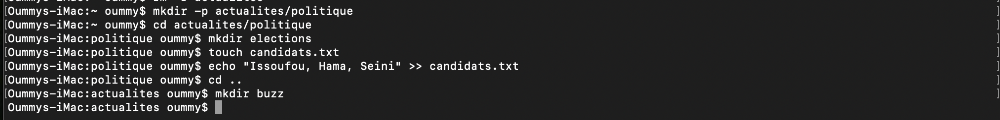

# Correction de l'exercice N°3

## les Commandes Utilisées

``` mkdir -p``` : Pour créer une arborescence de dossiers,je l'ai utilisé pour créer l'arborescence des dossiers **actualites/politique**
Syntaxe: ```mkdir nom_du_dossier```

``` cd ``` : Pour Aller d'un repertoire à un autre, je l'ai utilisé pour aller de mon repertoir personnel au dossier **actualite**.
Syntaxe: ```cd nom_du_repertoir```

NB: pour retourner dans son repertoir personnel il suffit de taper la commande ```cd```sans ajouter quelque chose.

```touch``` : Pour créer un ficher, je l'ai utilisé pour créer le fichier texte **candidats.txt**.
Syntaxe: ```touch nom_du_fichier```

```echo``` : Pour ajouter du texte dans un fichier, je l'ai utilisé pour ajouter le texte **Issoufou,Hama,Seini**

syntaxe:

```echo "texte_à_ajouter" >> nom_du_fihier_destinataire```


## Capture d'écran de l'exercice

