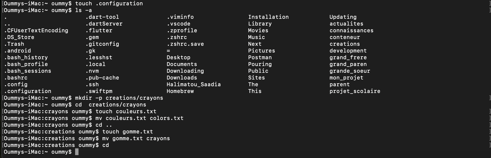

# Correction de l'exercice N°4

## les Commandes Utilisées

```touch``` : Pour créer un ficher, je l'ai utilisé pour créer le fichier caché texte **.config**.

Syntaxe: ```touch .nom_du_fichier.txt```


```ls -a``` : Pour lister le contenu  d'un dossier ainsi que les fichiers cachés, je l'ai utilisé pour vérifier le fichier caché **.configuration**

Syntaxe: ```ls -a nom_du_dossier```

``` mkdir -p``` : Pour créer une arborescence de dossiers,je l'ai utilisé pour créer l'arborescence des dossiers **creations/crayons**

Syntaxe: ```mkdir nom_du_dossier```

``` cd ``` : Pour Aller d'un repertoire à un autre, je l'ai utilisé pour aller de mon repertoir personnel au dossier **crayons** et egalement retourner dans mon repertoir personnel à la fin de l'exercice.
Syntaxe: ```cd nom_du_repertoir```

NB: pour retourner dans son repertoir personnel il suffit de taper la commande ```cd```sans ajouter quelque chose.


```touch``` : Pour créer un ficher, je l'ai utilisé pour créer le fichier texte **couleurs.txt** et **gomme.txt**.
Syntaxe: ```touch nom_du_fichier.txt ```

```mv``` : Pour deplacer/renommer un fichier/dossier, je l'ai utilisé pour renommer le fichier **couleurs.txt** en **colors.txt** et deplacer le fichier **gomme.txt** vers le dossier **crayon.txt**

Syntaxe: 

|  | Fichier          | Dossier |
| :--------------- |:---------------:| -----:|
| Déplacer  |   ```mv nom_du_fichier  chemin/vers/l'/emplacement```      |  ```mv nom_du_dossier chemin/vers/l'/emplacement```
| Renommer  | ```mv nom_actuel_du_fichier nouveau_nom_du_fichier```             |  ```mv nom_actuel_du_dossier nouveau_nom_du_dossier```  |


```pwd``` : Pour afficher le chemin vers l'emplacement courant de l'utilisateur (ex: **/Users/oummy/creations**)


## Capture d'écran de l'exercice

