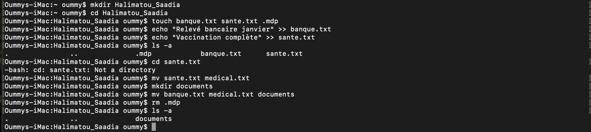

# Correction de l'exercice N°5

## les Commandes Utilisées

``` mkdir ``` : Pour créer un ou plusieurs nouveau(s) dossier(s), je l'ai utilisé pour créer le dossier avec mon nom 
Syntaxe: ```mkdir nom_du_dossier```

``` cd ``` : Pour Aller d'un repertoire à un autre, je l'ai utilisé pour aller de mon repertoir personnel au dossier **Halimatou_Saadia**.
Syntaxe: ```cd nom_du_repertoir```

```touch``` : Pour créer un ficher, je l'ai utilisé pour créer le fichier texte **banque.txt** **sante.txt** et le ficher caché **.le_fichier_caché_en_question.mdp**.
Syntaxe: ```touch nom_du_fichier```

```echo``` : Pour ajouter du texte dans un fichier

syntaxe:

```echo "texte_à_ajouter" >> nom_du_fihier_destinataire```

```ls -a``` : Pour lister le contenu  d'un dossier ainsi que les fichiers cachés, je l'ai utilisé pour vérifier le fichier caché **.le_fichier_caché_en_question.mdp**

Syntaxe: ```ls -a nom_du_dossier```

```mv``` : Pour deplacer/renommer un fichier/dossier, je l'ai utilisé pour renommer le fichier **sante.txt** en **medical.txt** et deplacer le fichier **medical.txt** et **banque.txt** vers **User/oummy/Halimatou_Saadia/un_nouveau_dossier_documents**

Syntaxe: 

|  | Fichier          | Dossier |
| :--------------- |:---------------:| -----:|
| Déplacer  |   ```mv nom_du_fichier  chemin/vers/l'/emplacement```      |  ```mv nom_du_dossier chemin/vers/l'/emplacement```
| Renommer  | ```mv nom_actuel_du_fichier nouveau_nom_du_fichier```             |  ```mv nom_actuel_du_dossier nouveau_nom_du_dossier```  |

```rm``` : Pour supprimer un fichier/dossier,je l'ai utilisé dans l'exercice pour supprimer le fichier caché **.le_fichier_caché_en_question.mdp**

Pour supprimer un dossier il faut ajouter l'option ```-r```(récursif) afin d'indiquer à la commande rm de supprimer le dossier ainsi que tout son contenu.

syntaxe:

Supprimer un simple fichier: ```rm nom_du_fichier.txt```

Supprimer un dossier: ```rm -r nom_du_dossier```

## Capture d'écran de l'exercice

